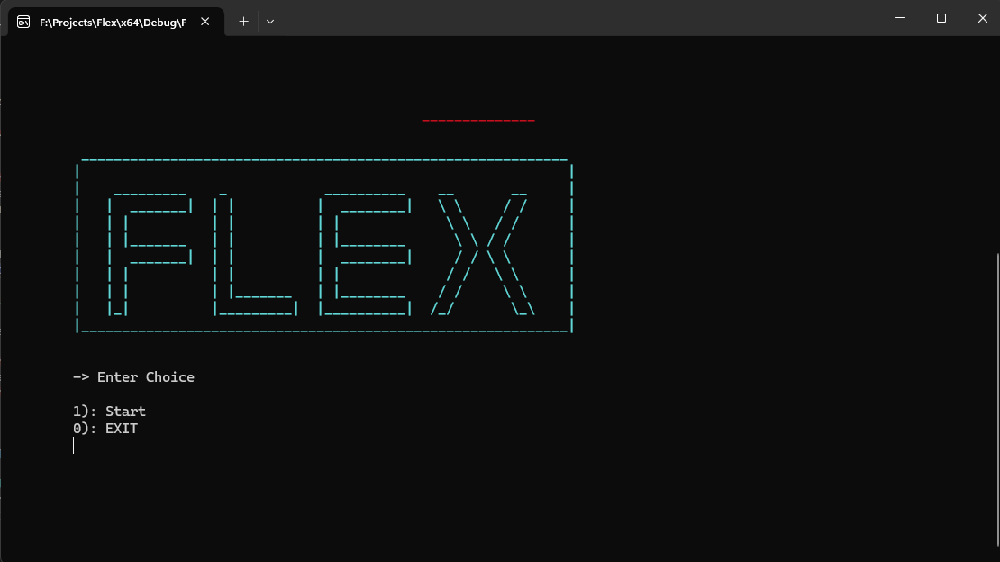

# Flex Academic Portal (Console-Based C++ OOP Project)

## LinkedIn [Ali Hassn](https://www.linkedin.com/in/ali-hassan-08b306226)

## Overview

Flex is a console-based academic portal built in C++ using Object-Oriented Programming (OOP) principles. The portal manages various academic activities for students, teachers, and admin users. It allows students to view their marks and attendance, teachers to manage student records, and the admin to control user information within the system.

## Features


- 
- 

### Students:
- View marks for quizzes, assignments, midterms, finals, class participation, and presentations.
- View attendance records.
- Register for courses.

- 

### Teachers:
- View lecture schedules.
- Update student attendance.
- Update marks for academic activities.

- 

### Admin:
- Add or remove students and teachers.
- Manage information related to students and teachers.

- 

## Project Structure

This project contains the following key files and folders:

- **Flex.sln**: The Visual Studio solution file for the project.
- **Header.h**: Header file containing function declarations, class definitions, and other declarations.
- **main.cpp**: The main entry point for the application, handling the core logic.
- **Source.cpp**: Contains the implementation of various classes and functions used in the project.
- **resource.h**: A resource header file typically used in Visual Studio projects.
- **.gitignore**: Specifies files and folders that should be ignored by Git.
- **README.md**: This file, providing an overview and instructions for the project.

### Additional Files:
- **StudentCourses.txt**: Contains data related to the courses a student is enrolled in.
- **StudentData.txt**: Stores information about students.
- **TeacherClassData.txt**: Stores information about teacher's classes.
- **schedule.txt**: Contains schedule details for teachers and students.

## Getting Started

### Prerequisites

- **Visual Studio**: Make sure you have Visual Studio installed with C++ development tools.
- **Git**: If you want to contribute or track changes, Git should be installed on your machine.

### Setup Instructions

1. **Clone the Repository:**
   ```bash
   git clone https://github.com/JIN-15/Flex-Academic-Record.git
   ```

2. **Open the Solution:**
   - Open Visual Studio.
   - Go to `File` > `Open` > `Project/Solution`.
   - Navigate to the cloned repository and open `Flex.sln`.

3. **Build and Run the Project:**
   - In Visual Studio, set the configuration to `Debug` or `Release`.
   - Press `Ctrl + F5` to build and run the project.

## Contributing

If you would like to contribute to this project, please fork the repository and submit a pull request. Contributions are welcome!

## Contact

For any inquiries or issues, please contact [Ali Hassan](mailto:hassanakramali@gmail.com).